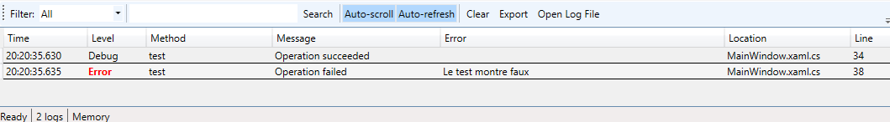

# ResultLogger.WPF

[](https://www.nuget.org/packages/MatthL.ResultLogger/)
[](https://opensource.org/licenses/MIT)

Package with ResultLogger + its LogViewer in WPF


## Installation
```bash
dotnet add package MatthL.ResultFlow.WPF
```
## 📖 Overview


## ⚙️ Configuration
Calling the control :
```C#
var viewer = new LogViewer();
var window = new Window();
window.Content = viewer;
window.show();
);
```

## 💡 Display



- Filter for LogLevels
- Search by text
- Auto scroll and auto refresh
- Clear 
- Export
- Open Log File 


### 📄 License
MIT License - see LICENSE file for details.

<div align="center">
Made with ❤️ by <a href="https://github.com/matthieu-x">Matthieu L</a>
</div>